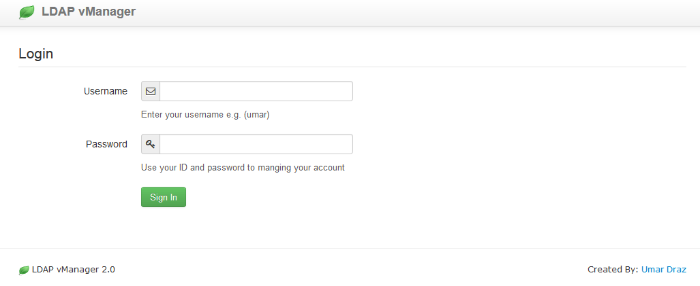
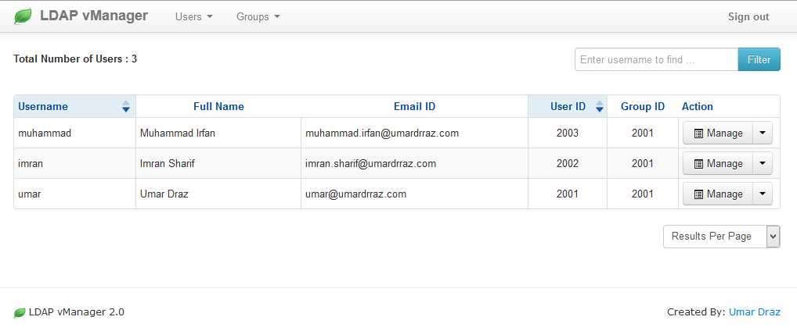
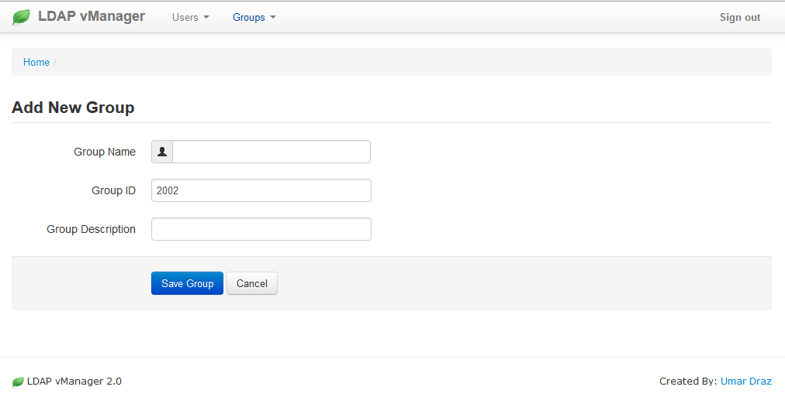
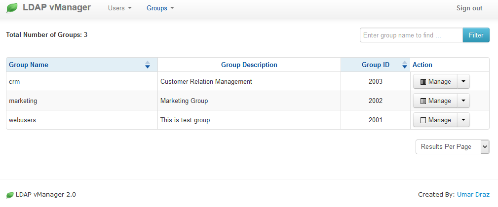

LDAP vManager
================

LDAP vManager is a Web Based Management tool created for LDAP and SAMBA domain controller with PHP

What is it?
============

The LDAP vManager provides a web based LDAP and SAMBA administration system to allow Unix/Linux administrators to easily manage users and groups of LDAP and SAMBA.

Postfix vManager was written in PHP, It requires PHP 4 and above, Aapache LDAP and SAMBA 4

1. Features
===========

Standard and enhanced features of LDAP vManager includes:

* Super admin user level with full access.
* Indivisual user access for changing information and password.
* Multiple attributes options.
* Two Factor Authentication with YubiKey.
* Samba user management.

2. Screenshots
==============

Here is some screenshots of LDAP vManager.

1. Login Page
--------------

2. Users List
--------------

3. New Group
-------------

3. Groups List
-------------

2. How to Install
=================

**Ubuntu:**  https://github.com/umardraz/LDAP-VManager/blob/master/LDAP-vManager-Ubuntu.rst

**For any bug Report or suggesions:** Please email me umar_draz@yahoo.com
